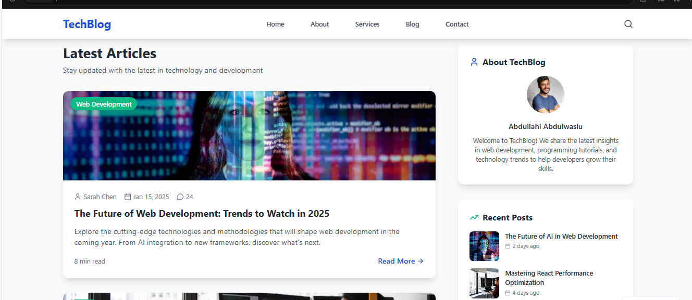

# Python WordPress Automation

This project provides a complete automation system for WordPress powered by Python. It integrates advanced AI-driven workflows with WordPress to simplify content creation, media management, and CRM automation.

The system leverages a Large Language Model to generate high quality articles and supports embedding media such as images and videos from external sources. By connecting directly to the WordPress REST API, the project enables seamless publishing without manual intervention. This creates a fully automated pipeline from content generation to publication.

In addition to content automation, the project extends its functionality to automate CRM-related tasks inside WordPress. With Python as the backbone, it manages data flow, interacts with WordPress users, and streamlines repetitive business processes.

This repository demonstrates how AI can be integrated with content management systems to reduce workload and boost productivity. It is designed to be modular, extensible, and easy to deploy for real-world applications. Developers can expand the system with additional APIs, models, or automation tasks to suit custom workflows.

## Features

- Content generation using a Large Language Model with natural language prompts  
- Automated publishing to WordPress through the REST API  
- Integration of media assets including images and videos  
- CRM automation within WordPress powered by Python scripts  
- Scalable design that can be adapted for other AI or automation use cases  

## License

This project is released under the MIT License.
